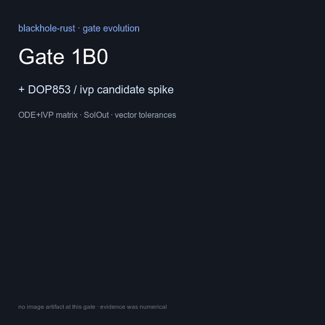

# Gargantua Relativistic Renderer

An offline-first Rust project for scientifically defensible images of light in a
Kerr spacetime. The visual target is inspired by the phenomena shown around
Gargantua in *Interstellar*, not an exact reconstruction of Double Negative's
proprietary assets, renderer, grading, camera, or undocumented production
parameters.

## Status: Gate 2D1 authoritative PASS (pending merge)

Gate 0–2D0 are complete on `main` (Gate 2D0 merge `b832e47`, PR #20).
Gate 2D1 scene appearance evaluated **PASS** @ `8d7e13a` (eval content
`3b027403…`): D1-B derived disk modulation + E1-B procedural finite-boundary
environment + S2 composition; A1–A6 binding. Identity
`presentation_frame_digest` `f8e10323…` exact; scene beauty
`presentation_frame_digest` `68b55544…`. Inherited 2C1
`physical_color_digest` `16663188…` exact.
GPU and GUI remain deferred. E1 research remains `PAUSE_RESEARCH_WEDGE`.
Do not begin Gate 2D2/2D3, E2, E3, GPU, wgpu, or GUI.



Scientific channels remain authoritative; Gate 2D0/2D1 add display-referred
beauty PNGs. Regenerate with `python3 scripts/build_evolution_gif.py` after new
gate artifacts land; keep this GIF linked from the README on subsequent commits.

See [physical disk emission V1](docs/physical-disk-emission-v1.md),
[physical colorimetry V1](docs/physical-colorimetry-v1.md),
[presentation pipeline V1](docs/presentation-pipeline-v1.md), and
[scene appearance V1](docs/scene-appearance-v1.md).
Gate 2D0 report: [gate-2d0-final-report](docs/work-log/gate-2d0-final-report.md).
Gate 2D1 report: [gate-2d1-final-report](docs/work-log/gate-2d1-final-report.md).

## What this is / is not

- Kerr geodesic ray tracing with typed terminations;
- physical thin-disk emission and CIE colorimetry (2C0/2C1);
- presentation-only SDR beauty (2D0);
- production scene appearance: disk structure + celestial environment (2D1);
- not film/DNGR reconstruction;
- not GPU / interactive GUI (deferred).

## Layout

```text
crates/relativity-core      # Kerr geometry, coordinates, observers
crates/relativity-integrate # DOP853 geodesic integration
crates/relativity-trace     # camera grid, outcomes, celestial map
crates/relativity-render    # emission / color / presentation / appearance
crates/relativity-oracle    # oracle corpus helpers
xtask                       # CLI, evaluators, PNG encoder
presets/                    # physical + presentation + appearance presets
docs/                       # ADRs, assumptions, gate reports
```

## Quick commands

```bash
cargo run --release -p xtask -- evaluate --scope gate-2d1-scene-appearance
cargo run --release -p xtask -- \
  render-scene-appearance \
  --preset presets/gargantua-physical-v1.toml \
  --appearance presets/appearance/gargantua-scene-v1.toml \
  --presentation presets/presentation/gargantua-cinematic-v1.toml \
  --tier gate \
  --output-dir artifacts/gate-2d1-scene-appearance \
  --execution parallel --threads 8 --require-release
```

Physical, presentation, and scene-appearance outputs are separate products.
E1 remains `PAUSE_RESEARCH_WEDGE`.
